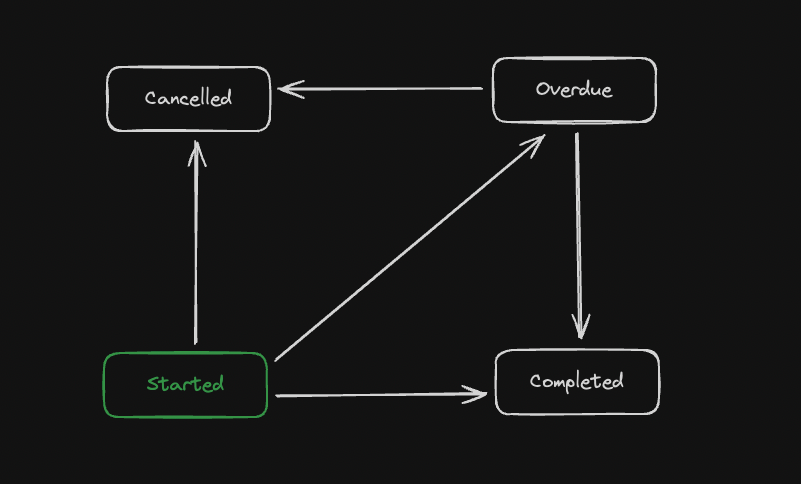
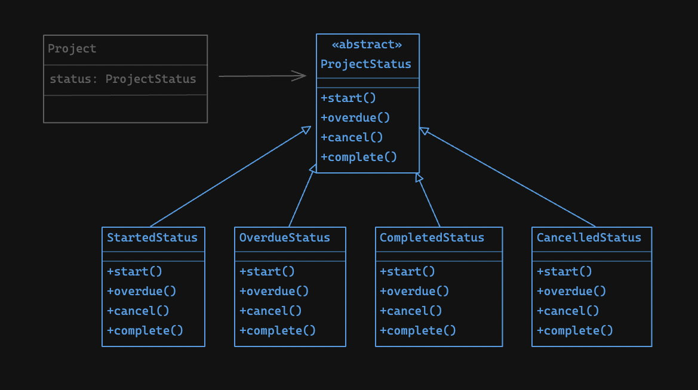

Hey there! 👋

In this article I'm going to share my experience with **Domain Driven Design** (DDD) in **Node.js** with **TypeScript**.
Well, the idea is not too complicated, imagine you're tasked to create a Project Manager and you come up with some initial
entities like: `Project`, `ProjectStatus`, `Task`, `TaskStatus`, `Tag`, `User` and a couple of **value objects** that seem essential
to the challenges ahead.

In order to manage the status of the project, you need to set up some business rules and limit what it's possible and what can't be
done in regard to status changes. This is a good place to apply the State pattern [1].

### The Project Status as a State Pattern

Firstly, do you know what a State pattern is? The main idea is that there's a finite number of possible states
your Project could be in, for example: **Started**, **Overdue**, **Completed** or **Cancelled**. If the status of the
project is **Started** and you call the function `overdue()` an **OverdueStatus** will be instantiated and set to the status of
the Project entity. Once the status of the Project is **overdue** you can only change it to **completed** (calling the `complete()`
function) or **cancelled**; you're not able to call `start()` because it would result in an error at this point [2].



In the app we're going to build, the structure looks like this: 4 concrete status classes implements the functions from an abstract
**ProjectStatus** class and the Project entity has a status of **ProjectStatus** type:



#### Project Status
```typescript
type UpdateStatusCallback = { (newStatus: ProjectStatus): void };

export default abstract class ProjectStatus {
  abstract value: string;

  constructor(protected readonly updateStatusCallback: UpdateStatusCallback) {}

  abstract start(): void;
  abstract overdue(): void;
  abstract complete(): void;
  abstract cancel(): void;
}


export class StartedStatus extends ProjectStatus {
  value = "started";

  constructor(updateStatusCallback: UpdateStatusCallback) {
    super(updateStatusCallback);
  }

  start(): void {
    throw new Error("Project already started");
  }

  overdue(): void {
    this.updateStatusCallback(new OverdueStatus(this.updateStatusCallback));
  }

  complete(): void {
    this.updateStatusCallback(new CompletedStatus(this.updateStatusCallback));
  }

  cancel(): void {
    this.updateStatusCallback(new CancelledStatus(this.updateStatusCallback));
  }
}

// (...) OverdueStatus
// (...) CompletedStatus
// (...) CancelledStatus
```

Let me explain each part for you... **ProjectStatus** has a `value` (the status itself) and it has 4 functions that changes the internal
`value` of the status. When we create a new **Project** we instantiate its status as a **StartedStatus** type in the **Project's** constructor
(as you can see bellow). If you want to see the complete version check the
[git repository](https://github.com/almeidacavalcante/domain-driven-design-experience) [3]

#### Part of Project entity
```typescript
export default class Project extends Entity<Props> {
  constructor(props: Props, id?: string) {
    super(props, id);
    if (!props.status) {
      this.props.status = new StartedStatus(this.updateStatus.bind(this));
    }
  }

  protected updateStatus(newStatus: ProjectStatus): void {
    this.props.status = newStatus;
  }
  // rest of the class
}
```

And we pass the reference of the protected `updateStatus` function, as we prefer to keep the status property non-public,
in order to safeguard the object's internal state, ensuring its consistent integrity throughout the software's
life cycle and reducing fragility.

### The `Props` interface

You have the option to pass all properties using the Project's constructor, but the list can get quite big quickly. Other inconvenient
you'd have with this approach is about the parameter's order, you've to know exactly the order of the parameters (not to mention
the ones that are optionals). Using a Props interface we avoid all those aforementioned problems.

The Props interface functions similarly to a Data Transfer Object (DTO). It contains a list of all the necessary properties
for constructing the object. When using the Project's constructor, you only need to pass the props. Additionally, if you're
constructing or restoring an existing object from the database, an optional entity ID is required. Consider the following example
for a clearer understanding.

#### Project
```typescript
interface Props {
  title: string;
  description: string;
  status?: ProjectStatus;
  userId: UniqueEntityID;
  createdAt: Date;
  updatedAt?: Date;
  deadline: Date;
  tasks: Task[];
  tags: Tag[];
}

export default class Project extends Entity<Props> {
  constructor(props: Props, id?: string) {
    super(props, id);
    if (!props.status) {
      this.props.status = new StartedStatus(this.updateStatus.bind(this));
    }
  }

  protected updateStatus(newStatus: ProjectStatus): void {
    this.props.status = newStatus;
  }

  get title(): string {
    return this.props.title;
  }

  get description(): string {
    return this.props.description;
  }

  get updatedAt(): Date | undefined {
    return this.props.updatedAt;
  }

  get createdAt(): Date {
    return this.props.createdAt;
  }

  get status(): string {
    if (!this.props.status) {
      throw new Error("Project status is not defined");
    }
    return this.props.status.value;
  }

  public finish() {
    this.props.status?.complete();
    this.props.updatedAt = new Date();
  }

  public overdue() {
    this.props.status?.overdue();
    this.props.updatedAt = new Date();
  }
}

```

### The Base Entity

This class is quite simple, it uses a `Generic` type to receive the Props from the actual domain entities, and it has a
private `_id` which is a random Universally Unique Identifier (UUID). We created a **value object** to abstract the UUID in the
`UniqueEntityID`

Generics allows you to pass an external type, in this case the type Props, but it can be any type indeed. Project inherits from
Entity and passes whatever the props the Project class has: `class Project extends Entity<Props>  {...}`.

#### Entity
```typescript
import UniqueEntityID from "./unique-entity-id";

export default class Entity<Props> {
  private _id: UniqueEntityID;
  protected props: Props;

  constructor(props: Props, id?: string) {
    this._id = new UniqueEntityID(id);
    this.props = props;
  }

  get id(): UniqueEntityID{
    return this._id;
  }
}
```

#### UniqueEntityID
```typescript
import {randomUUID} from "node:crypto";

export default class UniqueEntityID {
  private readonly _value: string;

  constructor(id?: string) {
    this._value = id || randomUUID();
  }

  get value(): string {
    return this._value;
  }
}
```

### The tests

Testing what you do is highly valuable. The concept of a Domain Model, as outlined by Fowler (2002) [4], is based on the
complete segregation of your domain core from external dependencies, which simplifies its testing.

Let's take a look at some initial tests for the `Project` entity:

```typescript
import UniqueEntityID from "../../domain/entities/unique-entity-id";
import Project from "../../domain/entities/project.entity";
import {expect} from "vitest";

describe('Project tests', function () {
    it('should create a Project successfully', function () {
        const project = new Project({
            title: 'Test Project',
            description: 'Test Project Description',
            userId: new UniqueEntityID(),
            createdAt: new Date(),
            deadline: new Date(),
            tasks: [],
            tags: []
        });
        expect(project.updatedAt).toBeUndefined();
        expect(project).toBeInstanceOf(Project);
        expect(project.status).toBe('started');
    });

    it('should create a Project successfully and finish it', function () {
        const project = new Project({
            title: 'Test Project',
            description: 'Test Project Description',
            userId: new UniqueEntityID(),
            createdAt: new Date(),
            deadline: new Date(),
            tasks: [],
            tags: []
        });
        project.finish();
        expect(project.updatedAt).toBeInstanceOf(Date);
        expect(project).toBeInstanceOf(Project);
        expect(project.status).toBe('completed');
    });
    
     // (...)
});

```

Next steps: we should create tests to verify if an exception is thrown when attempting to change the status
from 'completed' to 'started', or any other invalid status change.

### Conclusion

It's interesting how putting technical concepts into practice can solidify our understanding. Working with the State pattern and
using value objects instead of string properties really boosted my understanding of DDD principles. It's nice to see the concepts
coming to life.

### References

[1] Erich Gamma; Richard Helm; Ralph Johnson; John M. Vlissides (1995). Design Patterns: Elements of Reusable Object-Oriented Software. Addison-Wesley. ISBN 0-201-63361-2. \
[2] [OverdueStatus start() function](https://github.com/almeidacavalcante/domain-driven-design-experience/blob/bc925d6f3f6214b256a1b8c6c7c07b382a846910/src/domain/entities/project-status.ts#L49-L51) \
[3] [Project's repository](https://github.com/almeidacavalcante/domain-driven-design-experience) \
[4] *Fowler, M. (2002). "Domain Model." In Patterns of Enterprise Application Architecture. Boston, MA: Addison-Wesley. p. 116.*

