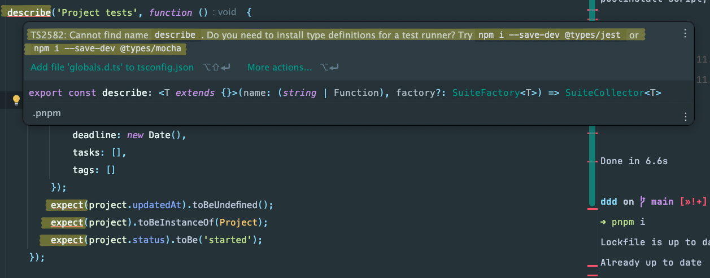

Howdy! 👋

During my journey with Vitest, I compiled some valuable configurations and problem-solving strategies.
My goal with this article is to help you in case you're just starting off with Vitest.

### Installation

To add Vitest to your project, let's first create a new project and install Vitest as a dev dependency:

```bash
pnpm init
pnpm add vitest -D  
pnpm add vite-tsconfig-paths -D
```

I prefer using TypeScript in my projects, so I also install the following dependencies:

```bash
pnpm add typescript @types/node -D
npx tsc --init
```

- `typescript` and `@types/node` are required to use TypeScript in the project.
- `npx tsc --init` initializes the TypeScript configuration file `tsconfig.json`, which is an important file.
> Note: As you can see, I'm using `pnpm` as my package manager. You can use `npm` or `yarn` instead.

### Vitest global configuration

If you try to create a test file now, you'll notice that some keywords are not globally recognized by your IDE (VSCode or Webstorms for example). Let me
show you what I mean:



To fix this you can import `except`, `describe`, `it` and `test` from `vitest` in your test files, but this is not ideal since you'll have to do this in every test file you create. 
Let's make those reserved keywords globally available by configuring Vitest properly.

In your `vitest.config.ts` file, add the following:

```typescript
import { defineConfig } from 'vite'
import tsConfigPaths from 'vite-tsconfig-paths'

export default defineConfig({
    plugins: [tsConfigPaths()],
    test: {
        globals: true,
        include: ['**/*.test.ts', '**/*.spec.ts'],
    }
})
```

`tsConfigPaths` allows Vitest to use the `paths` property in `tsconfig.json` to resolve modules. 
The `test: {globals: true}` property is where we configure Vitest to recognize the reserved keywords globally.

Now your IDE should recognize the keywords, and you can start writing tests (some IDEs might require a restart).

Using this configuration you'll probably avoid some known vitest errors like: **Cannot find module ./relative-path** as you can see here [in the vitest.dev](https://vitest.dev/guide/common-errors.html#:~:text=It%27s%20possible%20that%20your%20rely%20on%20baseUrl%20in%20your%20tsconfig.json.%20Vite%20doesn%27t%20take%20into%20account%20tsconfig.json%20by%20default%2C%20so%20you%20might%20need%20to%20install%20vite%2Dtsconfig%2Dpaths%20yourself%2C%20if%20you%20rely%20on%20this%20behaviour.)

Now let's work on the TypeScript configuration.

### Configuring root path as '@/'

Another nice configuration you can add to your project is the root path. Instead of having multiple relative paths in your imports, 
you can have a root path that points to the `src` folder.

Open your `tsconfig.json` file and add the following properties:

```json
{
  "compilerOptions": {
     "baseUrl": "./",               
     "paths": {
       "@/*": ["./src/*"],
     },
     // (...) other options
  }
}
```

Now you can import your modules like this:

```typescript
import { User } from '@/models/User'
```

instead of importing like this:

```typescript
import { User } from '../../../models/User'
```

### That's it!

I hope this article helped you in some way. If you have any questions or suggestions, feel free to reach out to me on [Instagram](https://www.instagram.com/almeida.cavalcante).
